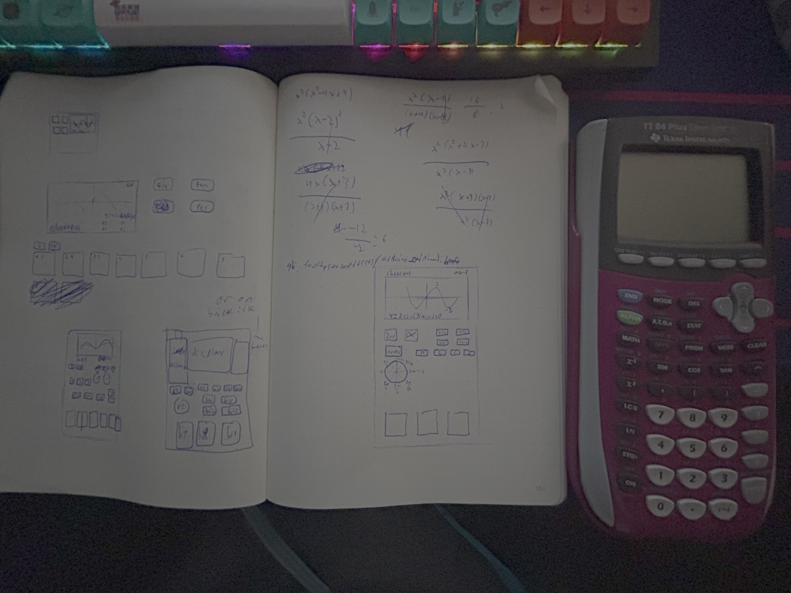

# 21 may

## "the highway to hardware"

for a while now, i've wanted to build things. i made a keyboard last year, which is cool. but it wasn't really my own design. i'd like to change that here. 

my 1st project for highway is a synthesizer called cheerful.

>ℹ️ info
>cheerful was originally an mp3 player... how this has changed
>i'll be providing some anecdotes here about the project

right now, it's built around a raspberry pi pico, but that could easily change.
speaking of pico, today i added the pico into a schematic (wrong terminology idk) for fusion 360's pcb editor. it just kinda worked out that it was an example for [this](https://www.youtube.com/watch?v=H6CNmnT6kGo) youtube video.

i've never actually designed a pcb before, so it'll certainly be super interesting!

another key thing today was design of the form factor. i decided on a graphing calculator because the synth itself works off of sine wave transforms, so i thought it was appropriate.

here's a picture of some of the concept art (with my ti-84 plus for scale):

anyway, that's it for day one! 

thanks for reading!
-levi

**total time tdy: 1hr 50min**
